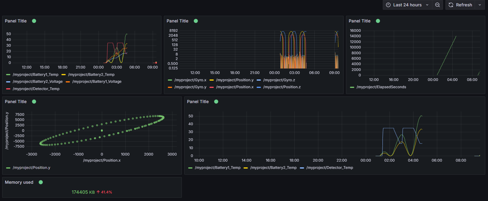
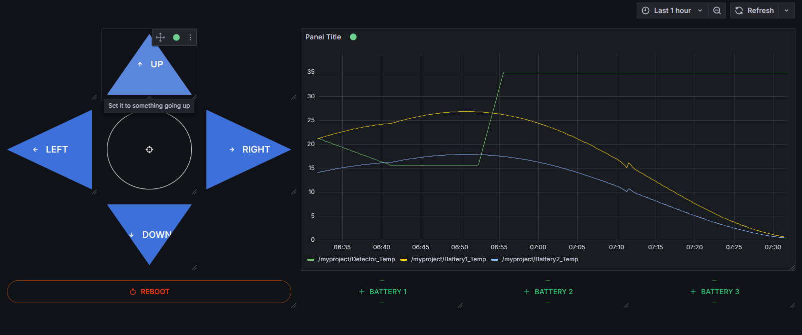

# JAOPS Grafana Yamcs Plugin

This repository holds the codebase for the Grafana-Yamcs plugin by JAOPS.

This is under active development and community contributions are welcome.

#### Acknowledgement: 
Since October 2024, the plugin has been tested and improved with feedback from the Space Robotics Lab in Sendai, Japan.

## Features

- **Multiplexed Endpoint Support** – Designed to handle complex setups with multiple Yamcs endpoints through a robust multiplexer system.

- **Modular and Scalable Architecture** – Clean separation of concerns and a solid backend structure built for reliability and flexibility.

- **Commanding Panel** – Issue commands via a Grafana panel with fully customizable buttons, supporting arguments, comments, and endpoint targeting.

- **Telemetry & Static Image Panel** – Visualize real-time telemetry data or overlay data on static images (e.g. spacecraft layouts, maps).

- **Intuitive UI/UX** – Clean and simple user interface designed to be easy to use, even for non-experts.

- **Fully Configurable** – Every aspect of the plugin—from endpoint configuration to command structure and visual layout—is configurable through Grafana's settings.

- **Live Status Feedback** – Displays endpoint availability and WebSocket status in real-time, ensuring quick diagnostics.

## Screenshots

#### Telemetry



#### Commanding



## Try out the plugin for yourself

### Pre-requisites

To try out the plugin on a local machine, you will need the following tools:
- Go 1.23+
- [Mage](https://magefile.org/) 
- Node.js (with NPM or PNPM)
- Docker

> [!IMPORTANT]  
> If you want to set-up the plugin in a Windows environment, you will need to run the plugin under WSL, so you will need WSL installed, and have the tools above all installed in the WSL environment except for Docker. Docker needs to be installed in the default Windows environment, because Docker has a WSL relay.

### Set up the plugin

1. Install back-end and front-end dependencies using the following:

    ```bash
    go mod download
    pnpm install
    ```

2. Compile the back-end using Mage:

    ```bash
    mage build:backend
    ```

### Run the plugin

1. Run front-end in dev mode (watches for changes)

    ```bash
    pnpm run dev
    ```

- Or just build the front-end:

    ```bash
    pnpm run build
    ```

2. Run back-end with a Grafana instance

    ```bash
    pnpm run server
    ```

That's it, you should have a grafana instance running at port `3000`, head inside to find further instructions on how to use the plugin (click on **More Apps > Grafana-Yamcs Integration** on the side bar).

## Other commands you can run

### Backend

1. Update [Grafana plugin SDK for Go](https://grafana.com/developers/plugin-tools/key-concepts/backend-plugins/grafana-plugin-sdk-for-go) dependency to the latest minor version:

    ```bash
    go get -u github.com/grafana/grafana-plugin-sdk-go
    go mod tidy
    ```

2. Build backend plugin binaries for Linux, Windows and Darwin:

    ```bash
    mage -v
    ```

3. List all available Mage targets for additional commands:

    ```bash
    mage -l
    ```

### Frontend

1. Install dependencies

    ```bash
    pnpm install
    ```

2. Build plugin in development mode and run in watch mode

    ```bash
    pnpm run dev
    ```

3. Build plugin in production mode

    ```bash
    pnpm run build
    ```

4. Run the tests (using Jest)

    ```bash
    # Runs the tests and watches for changes, requires git init first
    pnpm run test

    # Exits after running all the tests
    pnpm run test:ci
    ```

5. Spin up a Grafana instance and run the plugin inside it (using Docker)

    ```bash
    pnpm run server
    ```

6. Run the E2E tests (using Cypress)

    ```bash
    # Spins up a Grafana instance first that we tests against
    pnpm run server

    # Starts the tests
    pnpm run e2e
    ```

7. Run the linter

    ```bash
    pnpm run lint

    # or

    pnpm run lint:fix
    ```

## Contributions

Contributions are welcome!  
If you find a bug, have a feature request, or want to improve the project, feel free to open an issue or submit a pull request.

Please follow the existing code style and include tests if applicable. For major changes, it's recommended to open a discussion first. Read the [contributing guidelines](CONTRIBUTING.md) for further indications on how to contribute.

## License

This project is licensed under the [MIT License](LICENSE).  
You are free to use, modify, and distribute this software with proper attribution.