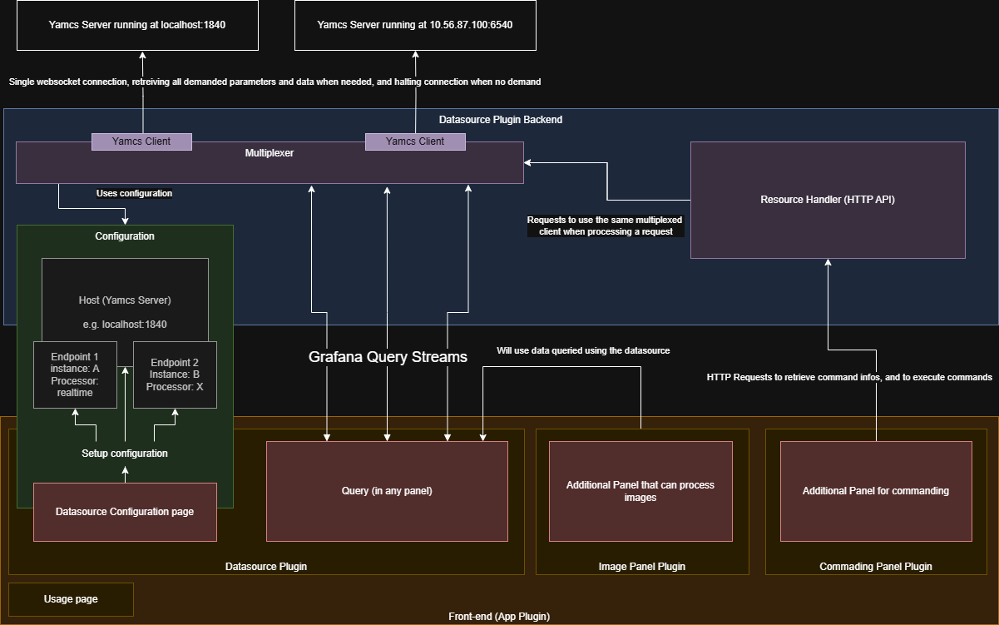
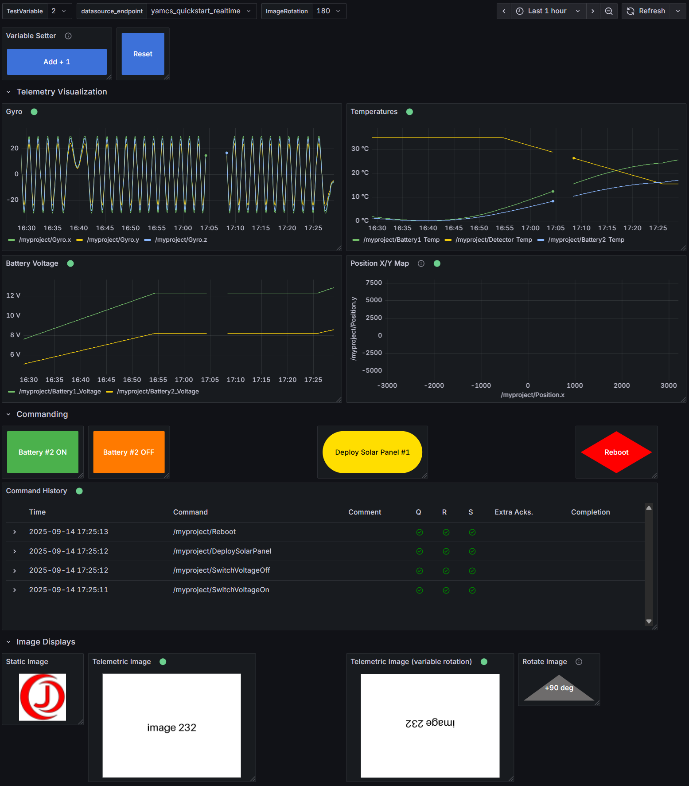

# JAOPS Grafana Yamcs Plugin

A Grafana plugin to directly connect to the Yamcs server, display telemetry and send commands.
This plugin is engineered for high reliability to be used in Mission Control Centers and anywhere Yamcs is used.

The current version has already been tested in real-world deployments but active development continues and community feedback and contributions are very welcome.


## Features

- **Multiplexed Endpoint Support** – Designed to handle complex setups with multiple Yamcs endpoints through a robust multiplexer system. Supports scaling to many Grafana clients efficiently by multiplexing the connections to Yamcs: the same data is only requested once.

- **Modular and Scalable Architecture** – Clean separation of concerns and a solid backend structure built for reliability and flexibility.

- **Telemetry & Static Image Panel** – Visualize real-time telemetry data or overlay data on static images (e.g. spacecraft layouts, maps).

- **Commanding Panel** – Issue commands via a Grafana panel with fully customizable buttons, supporting arguments, comments, and endpoint targeting.

- **Intuitive UI/UX** – Clean and simple user interface designed to be easy to use, even for non-experts.

- **Live Status Feedback** – Displays endpoint availability and WebSocket status in real-time, ensuring quick diagnostics.

- **Fully Configurable** – Every aspect of the plugin—from endpoint configuration to command structure and visual layout is configurable through Grafana's settings.




## Example Grafana Dashboard Connected to Yamcs

Demo Dashboards are provisioned in `provisioning/dashboards`, they showcase the main capabilities of the plugin.
They are made to use data from the [Yamcs quickstart](https://github.com/jaops-space/yamcs-quickstart).
After cloning the repository, run in three separate terminals:
```bash
./mvn yamcs:run
python3 simulator.sh
python3 simulator/images/generate_images.py
``` 




## Archive Database Configuration

The plugin supports querying telemetry from live Yamcs data.
## Try Out the Plugin for Yourself
Follow the [setup instruction](./setup_instructions.md) to get started in just a few minutes.

## Contributions

Contributions are welcome!  
If you find a bug, have a feature request, or want to improve the project, feel free to open an issue or submit a pull request.

Please follow the existing code style and include tests if applicable. For major changes, it's recommended to open a discussion first. Read the [contributing guidelines](CONTRIBUTING.md) for further indications on how to contribute.

## Acknowledgements

Since October 2024, the plugin has been tested and improved with feedback from the Space Robotics Lab of Tohoku University in Sendai, Japan.

## License

This project is licensed under the [MIT License](LICENSE).  
You are free to use, modify, and distribute this software with proper attribution.