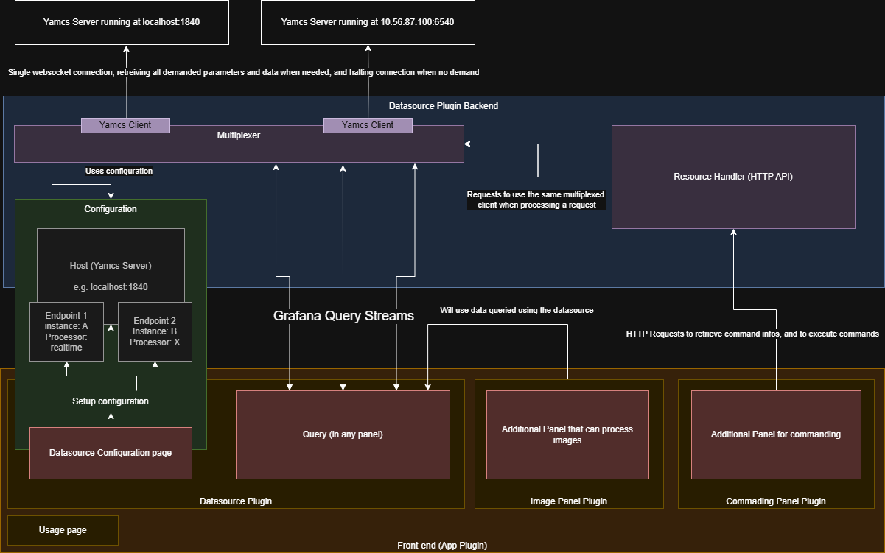

# Grafana Plugin for the Yamcs Mission Control Software

A Grafana plugin to directly connect to the [Yamcs](https://yamcs.org/) server, display telemetry, send commands, and more!

This plugin is engineered for high reliability to be used in Mission Control Centers and anywhere Yamcs is used. The current version has already been tested in real-world deployments but active development continues and community feedback and contributions are very welcome.

Development led by [JAOPS](https://www.jaops.com/): providing Mission Control software, tools and training for spacecraft in orbit and rovers on the Moon!


## Features

- **Multiplexed Endpoint Support** – Designed to handle complex setups with multiple Yamcs endpoints through a robust multiplexer system. Supports scaling to many Grafana clients efficiently by multiplexing the connections to Yamcs: the same data is only requested once.

- **Modular and Scalable Architecture** – Clean separation of concerns and a solid backend structure built for reliability and flexibility.

- **Image Panel** – Visualize real-time images from Yamcs or overlay data on static images (e.g. spacecraft layouts, maps).

- **Commanding Panel** – Issue commands via Grafana panels with fully customizable buttons, supporting arguments, comments, and endpoint targeting. Use the Command History Panel to keep track of commands sent, arguments and acknowledgements.

- **Intuitive UI/UX** – Clean and simple user interface designed to be easy to use, even for non-experts. Displays endpoint availability and WebSocket status in real-time, ensuring quick diagnostics. Every aspect of the plugin is configurable through Grafana's settings.



## Try Out the Plugin for Yourself
Search for Yamcs or JAOPS in the Grafana Marketplace.
Click "install"

## Example Grafana Dashboard Connected to Yamcs

Demo Dashboards are provisioned in `provisioning/dashboards`, they showcase the main capabilities of the plugin.
They are made to use data from the [Yamcs quickstart](https://github.com/jaops-space/yamcs-quickstart).
After cloning the repository, run in three separate terminals:
```bash
./mvn yamcs:run

python simulator.sh

pip install -r simulator/images/requirements.txt
python simulator/images/generate_images.py
``` 
Then launch grafana, configure the datasource for Yamcs and open the Demo Dashboard:


The plugin itself includes helpful tutorials for each panel.
Access them via the main navigation menu (on the left side)

## Contributions
Contributions are very welcome!  

If you find a bug, have a feature request, or want to improve the project, feel free to open an issue or submit a pull request.

Follow the [setup instruction](./setup_instructions.md) to get started with the development environment in just a few minutes.

Please follow the existing code style and include tests if applicable. For major changes, it's recommended to open a discussion first. Read the [contributing guidelines](CONTRIBUTING.md) for further indications on how to contribute.

## Acknowledgements

Since October 2024, the plugin has been tested and improved with feedback from the Space Robotics Lab of Tohoku University in Sendai, Japan.

## License

This project is licensed under the [MIT License](LICENSE).  
You are free to use, modify, and distribute this software with proper attribution.